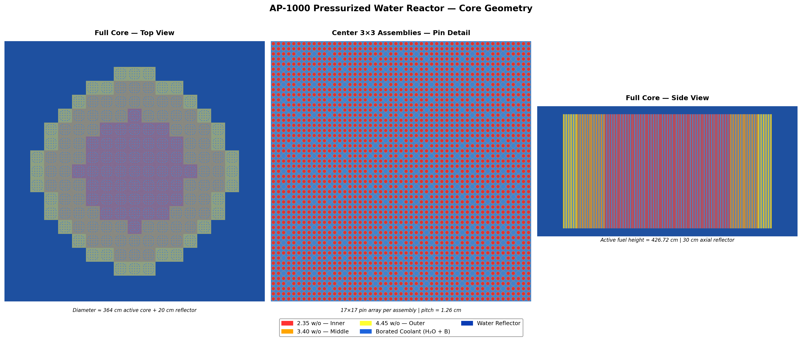
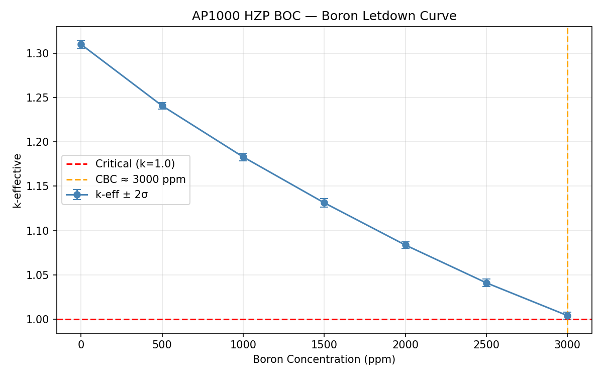

# AP1000 Full-Core Criticality Analysis — OpenMC

A pin-resolved, full-core Monte Carlo criticality model of the 
Westinghouse AP1000 pressurized water reactor (3400 MWth), 
developed in OpenMC under hot zero power / beginning-of-cycle 
(HZP/BOC) conditions.

## Model Description

### Geometry
- All 157 fuel assemblies modeled explicitly in a 17×17 pin array
- Per AP1000 Design Control Document (DCD) specifications
- Each assembly: 264 fuel rods, 24 Zircaloy-4 guide thimbles, 
  1 central instrument thimble
- Low-leakage three-zone enrichment pattern:
  - Inner (36 assemblies): 2.35 w/o ²³⁵U
  - Middle (72 assemblies): 3.40 w/o ²³⁵U
  - Outer (49 assemblies): 4.45 w/o ²³⁵U
- 20 cm borated water reflector with vacuum boundary condition

  

### Materials & Conditions
- Fuel temperature: 600 K (HZP conditions)
- Coolant/reflector: borated light water, 600 K, 0.707 g/cm³
- Thermal scattering: S(α,β) treatment for H in H₂O
- Cross section library: ENDF/B-VIII.0

### Simulation Parameters
- 50,000 particles per generation
- 70 inactive generations (fission source convergence)
- 130 active generations
- 6.5 × 10⁶ total active particle histories
- Assembly power and pin-level fission rate distributions 
  via regular mesh tallies

## Results

### Criticality
At 3000 ppm soluble boron:

**keff = 1.00210 ± 0.00037 (+209 pcm)**

All three independent k estimators (collision, track-length, 
and absorption) agree within mutual uncertainties, confirming 
statistical consistency.

### Boron Reactivity Worth
Boron letdown analysis performed over 0–3000 ppm in seven steps.
Linear regression yields:

**Differential boron worth = −7.75 pcm/ppm**

This agrees with the AP1000 design value range of 7–10 pcm/ppm 
(DCD Section 4.3), providing independent validation of the 
cross-section treatment and core geometry.

### Power Distribution
- Outer-peaked assembly power profile consistent with 
  low-leakage loading pattern
- Normalized peak power density ~1.4 in high-enrichment 
  outer ring
- Radial profile confirms characteristic outward power shift 
  relative to uniform-enrichment core

## Limitations
The predicted critical boron concentration (~3000 ppm) exceeds 
the design value of ~1500–1800 ppm by approximately 1400 ppm. 
This offset is fully explained by the intentional omission of:
- Integral fuel burnable absorbers (IFBA/WABA)
- Control rods

These components contribute an estimated 10,000–15,000 pcm of 
negative reactivity in the full design. A simplified reflector 
geometry (water only, no steel baffle or core barrel) introduces 
a small additional positive bias. The boron worth agreement 
confirms the underlying neutron physics is correctly captured.

## Tools & Libraries
- [OpenMC](https://openmc.org) Monte Carlo particle transport code
- ENDF/B-VIII.0 nuclear data library
- Python (model construction, post-processing, visualization)

## References
1. Romano et al., "OpenMC: A state-of-the-art Monte Carlo code 
   for research and development," Ann. Nucl. Energy, vol. 82, 
   pp. 90–97, 2015. doi:10.1016/j.anucene.2014.07.048
2. Westinghouse Electric Company, AP1000 DCD Rev. 19, Chapter 4, 
   Section 4.2, NRC ADAMS No. ML11171A444, June 2011.
3. Westinghouse Electric Company, AP1000 DCD Rev. 19, Chapter 4, 
   Section 4.3, NRC ADAMS No. ML11171A445, June 2011.

## Author
Eric Yokie | [LinkedIn](https://www.linkedin.com/in/ericyokie/)
